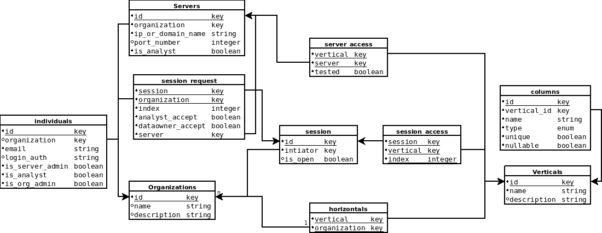

# Dashboard Design

The dashboard is a public, or optionally self-hosted, web application for managing MPC Sessions, and generating network and schema configuration information for SAFRN1.

The intention of the Dashboard is for organizations to synchronize their dataset schemas, coordinate MPC Sessions, and generate configuration files for their servers to join MPC sessions.

## TODO: login and registration (1.0?)
 - Organization creation: self created through registration system, admin created by system, or admin created by insert statement?
 - Individual login: self registration?
 - Individual admission to an organization: by organization admin? bootstrapping 1st organization admin?

## Virtual Schema (1.1)
Each organization owns, or has responsibility or custody for, data which they want to involve in MPC.
In order for multiple organizations to use their datasets together, they must agree on a specific format, or schema for their data.
The dashboard will track these schemas, allowing organizations to perform small reformat operations in order come up with compatible datasets.

## Server Administration (1.0)
An organization will own a number of servers which it will want to involve in MPC sessions.
The organization will register those servers in the dashboard, and can then register their access to a given data schema (1.1) and involve them in MPC sessions.

## MPC Sesssion Management (1.0)
When an organization wants to start doing MPC queries, they must request the peer organizations whom they would like to work with to join them.
They will start a session which others can join.
The Dashboard will ask them which data schemas they want to use (1.1), and which peers they would like to collaborate with (1.0).
Then it will await for each peer to accept a request to join the MPC Session, and input which of their servers will participate on their behalf (1.0).

Once all participants have accepted the request, they can download an automatically generated configuration file and install it to their server.
Then MPC querying can commence.

In 1.0, the generated configuration file is expected to cover only network configuration.
In 1.1 the generated configuration file should cover the network configuration as well as the schema configuration to as great an extent as possible.

### Automatic Schema Distribution (1.1)
In 1.1 we are also considering an automated schema distribution system in which the Dashboard will deliver a schema directly to each server, and each organization will have to reconfirm participation in a session in a server web-console interface, as a trust mechanism to prevent a dashboard from beginning a session before approval has occurred.

## Dashboard Schema
This is a meta database schema which the dashboard will maintain information regarding each party's servers and datasets.

TODO: schema description.