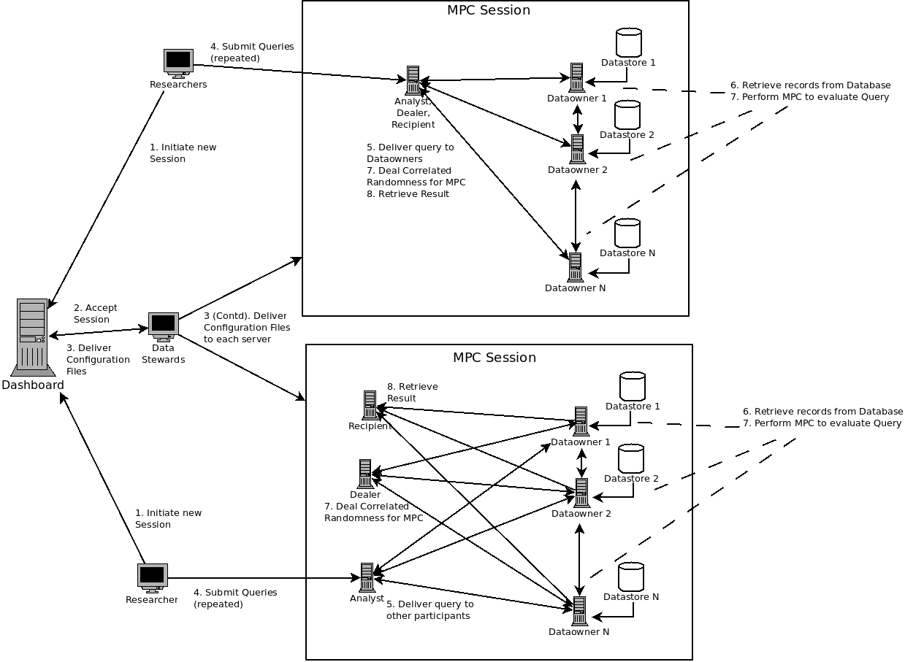
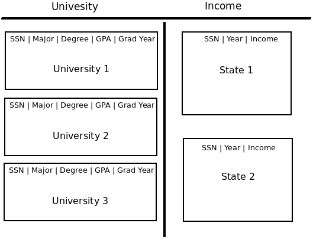

# SAFRN 1 High Level/Archietectural Design
> This document was created when the design document was partitioned into archietecural, theory, and detail design documents.

[[_TOC_]]

## Introduction and Summary of SAFRN 0
SAFRN0 is an MPC and Data Science research prototype in which a group of parties jointly compute statistics on a dataset held in partitions by each party.
SAFRN0 was built around the "Student Right to Know Before You Go Act", in which an _Analyst_ party, presumably a researcher at a university, directs one _Income_ server and one or more _Group_ servers, representing a collective of universities, to come up with statistics regarding salary or loan principal after graduation for various populations of students.
The _Income_ server is representative of a tax collection or lending organization which holds the incomes of all graduates, while the _Group_ servers hold distinguishing features such as age, gender, degree or GPA.
SAFRN 0 enablied the _Income_ party and the _Group_ parties to calculate mean incomes broken down by the distinguishing features held by the _Group_ parties.

The intent of SAFRN1 is to improve upon SAFRN0 in three ways:
 - Generalize the dataset schema, so that other partitioned datasets can be queried.
 - Produce results for a greater variety of statistical queries.
 - Minimize difficulties in configuring SAFRN.

At the moment, we expect SAFRN1 to be developed in two phases.
SAFRN 1.0 will focus on supporting the proposed "Student Right To Know Before You Go Act", however, instead of being purpose built for it, SAFRN 1.0 will be generalized to a range of data formats and calculations, one of which can be the "Student Right To Know Before You Go Act".
SAFRN 1.1 will focus on the broader audience, with improvements in configuration and discovery.
This document will focus on the final product, with annotations regarding implementation timeline.

### Notation
The following terms have indicated meaning within this and related documents.

 - **Lexicon**: a virtual schema for the datasets involved in SAFRN.
   The lexicon is known to all parties who must convert values from their local schemas to the lexicon's form.
 - **Vertical**: A lexicon is partitioned into column sets such that a single party might not have data in all columns.
   The partitioning scheme must be divided into well defined verticals, and each participant may have data in no more than one vertical.
 - **Query**: a request for a given computation.
 - **Session**: a prearranged configuration for a series of queries all sharing the same lexicon.
 - **Organization**: an institution owning or having custody over data with which it wishes to participate in a session.
 - **Peer**, **party**, or **participant**: refers to an organization by the server with which it participates in a session.
 - **Data steward**: a person who maintains an organization's data and servers with the goals of enabling data analysis whilst protecting the data from prying eyes.

I will use _Italics_, with the first letter capitalized, to distinguish parties by their role.

## SAFRN1 Parties Involved
The first participant that a user may encounter is the _Dashboard_, which is a publicly available web-tool for configuring SAFRN MPC Sessions.
The _Dashboard_ collects configuration information such as the lexicon, parties involved, connection information, and restrictions, and uses it to generate configuration files for other parties to begin a session.
The _Dashboard_ does not participate in sessions.
For more information on the _Dashboard_, see the [dashboard design](/doc/wiki/dashboard/design.md) (this document may be outdated).
The _Dashboard_ will be mentioned throughout this document, however this document does intend to focus on the design of _Dataowners_ and _Analysts_.

SAFRN1 defines four possible roles that a participant can take.
A participant can have one or more of these roles, however certain roles may have restrictions on combinations.

 - _Analyst_ submits queries to other parties for processing.
 - _Recipient_ recieves the results of queries when their processing is complete.
 - _Dataowner_ supplies data for MPC to act upon and participates in MPC protocols to perform a given calculation.
 - _Dealer_ distributes correlated randomness to _Dataowners_ for use while processing queries.
 For SAFRN1.0, we will have a single _Dealer_ who is forbidden from also being a _Dataowner_, however with SAFRN1.1 we may lift this restriction by allowing multiple _Dealers_ who may deal to peers other than themselves.

In the _Right to Know Before You Go_ example, the _Analyst_, _Recipient_, and _Dealer_ are the same party.
This is expected to be a common configuration for SAFRN.

## Lexicons and Data Representation
As SAFRN is a tool for processing data, the format of this data, which we call the lexicon, is an important component of SAFRN.
The lexicon is similar to the schema of a relational database, however records are owned (in a storage sense) by multiple parties.
There are two partition lines for this data.
The vertical partition acts similarly to a relational database's table, different verticals have different record formats, but often have keys which can be used to join two verticals into a single "view".
The horizontal partitions have different records of the same format.
Each partition is held by a different party, and one party may not have a partition of two different verticals (having two different horizontal partitions would be meaningless, as their union would be a single partition).
Notably, horizontal partitions are expected to be distinct, contain no duplicate records, although we do not currently verify this.

### Datatypes in SAFRN1
A column in SAFRN1 may have one of the following data types:

 - TODO: integers (in a given range)
 - TODO: fixed point real numbers

Categoricals is a special, multi-column, datatype.
In a relational database, you may have an enumeration column, or a string column with enumerated values.
The Categorical in SAFRN 1.0 takes this place, replacing each enumeration-value with a boolean (integer in range $`[0, 1]`$) column.
These columns are enforced to a "radio-button" semantic, such that at most one value of the categorical may be true for any given record in a query.

For example in the "Right to Know Before You Go" example, The _Group's_ major column is an enumeration of "math", "history", "english", and etc. In SAFRN1, this will be translated to one column for each major: ``major:math``, ``major:history``, ``major:english``, and etc.
For each record, exactly one of the ``major:`` columns will be true.

## Session Initiation
To initiate a session, data stewards at different organizations can use the _Dashboard_ to generate some configuration files.
Notably, use of the _Dashboard_ is optional, data stewards could perform all the tasks which the _Dashboard_ performs out of band.
However, use of the _Dashboard_ is recommended for simplicity.

When they are ready to configure their session, all data stewards can register their organizations with the dashboard.
Essential information collected during this process includes the following:

 - The organization's name and description/purpose (for display use).
 - A URL to download a PGP signature key, which the data steward can use to accept a session (optional).
 - A TLS public key for the server they wish to use during MPC (?).
 - Critically, the _Dashboard_ will issue a the organization a [unique ID](/doc/wiki/json-schemas/dbuid.md), which will be used during MPC Sessions to identify the organization and its server(s).

Once all organizations are registered, one data steward can use the dashboard to enter parameters for the [session configuration file](/doc/wiki/json-schema/session-config.md).
(TODO @paul or @kashili) The dashboard may (or may not) allow a draft period for a session, during which it may be edited.
Once a session is submitted, it cannot be modified, participants to the session will begin signing it with their PGP signature keys.
The session configuration file contains the following information:

 - A unique [Session ID](/doc/wiki/json-schemas/dbuid.md).
 - The lexicon for the session.
 - The roles and restrictions of each participant.
 - The TLS public key for each participant (?).
 - PGP public key URL for each participant (?).
 - Restrictions on queries which may be performed during the session.

Notably a session configuration file does not contain connection information for participants.
This is because the session configuration file is cryptographically signed to assure immutability, connection information is stored in a second file, the [peer configuration file](/doc/wiki/json-schemas/peer-config.md).
The peer configuration file is also generated by the dashboard, and requires each data steward to enter their server's connection information.
The _Dashboard_ will collect the following information from each participant and use it to generate a server configuration file:

 - Server connection information (IP Address or domain name, and TCP port number).
 - TLS public key (?).
 - PGP signature for the session config.
 - PGP public key URL (?).

## Querying in SAFRN 1

Querying in SAFRN1 is a multi-step process.
To process a query SAFRN follows this sequence of actions.

 1. _Analyst_ sends query to each _Dataowner_. The _Dataowners_ then read the query, test if it is acceptable, and determine a more detailed execution plan.
 2. Each _Dataowner_ locally queries their database.
 3. Join verticals using Private Set Operations.
 This results in either a joined set for computations using [Private Set Intersection](/doc/wiki/design/theory.md#private-set-intersection-and-union).
 For some computations, a PSI-Function uses an intermediate result instead of the full join to optimize its calculation.
 In those cases, it is conceptually simple to consider the intermediate value as the PSI's result.
 4. (Optional) A post filter uses MPC to compare columns across verticals, inorder to remove unwanted records.
 It may not be possible to use a post filter in conjunction with PSI-Function optimizations (?).
 5. The calculation is performed using MPC.
 In the case that the computation uses a full result set, this is the input.
 In the case of a PSI-Function, the intermeidate result of PSI is conceptually the input to this step, however in practice, this step may become part of a single PSI-Function.
 6. Calculation Results are revealed to recipients.

### Prefilters
During step 2 above, SAFRN can use the database query to filter records using the SQL ``WHERE`` clause.
The [query object](/doc/wiki/json-schemas/query.md) will define a syntax for expressing equality and ranged based filters for records.

One drawback of prefilters is that filters which require information from multiple verticals cannot be computed during this phase.

### Join
The Join phase uses Private Set Operations to join records based on equality of a subset of columns.
For an inner join we use PSIntersection, and for an outer join PSUnion.

### Postfilters
Postfilters perform similar filtering as prefilters, however they are computed under MPC, and can filter based on columns from multiple verticals.

### Computations
SAFRN Supports three primary categories of queries: Moments, Rankings, and Advanced.

#### Moments
Moments are the statistical mean, variance, skew, etc.
However the SAFRN1 Moments computation group also includes also includes the sum as the 0th moment and the frequency (count) as the -1st moment, and sum, as these are calculated similarly to moments.

Moments will be calculated as PSI-Functions.

#### Rankings
Rankings put records in the numeric order of a given column and return specific cells from the column.
Commonly used ranks are maximum, minimum, median, quartiles, and percentiles.

To calculate a ranking, SAFRN1 will use a secure sort, then reveal the specified ranks to the _Recipient_.

#### Advanced Calculations
At the moment the advanced calculations which SAFRN1 intends to support are Ridge Regression, the F-Test and the T-Test.

