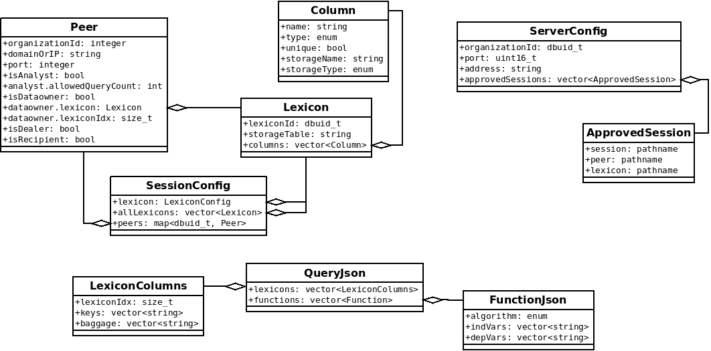
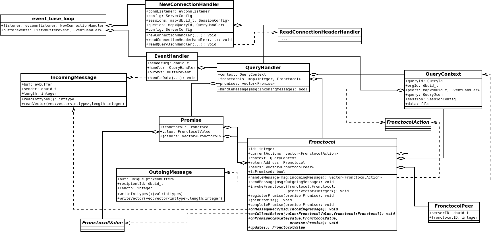

# SAFRN 1 Code-Level/Detailed Design
SAFRN1 will be implemented as a framework for treating small protocols as functions, converting inputs into outputs, and then using function composition to make larger protocols.
This is an elegant solution in contrast to the huge state machine which implemented SAFRN0.
Each "function-protocol" is a function in its purpose, and a protocol in its implementation.

To support function-protocols, we require an evaluation framework, the call stack which supports function composition in single party computations.
This evaluation framework tracks invocation and completion of function-protocols -- in a call tree instead of a stack, and provides a message-oriented network abstraction.
We have a call-tree because the distributed nature of MPC insists that a single party handle function-protocols with many peers simultaneusly.
A message can be recieved and directed to any function-protocol at any time, even if the function-protocol has given "control-flow" to another function-protocol invocation.
As a consequence, a function-protocol may also invoke many simultaneus function-protocols.

## Framework Configuration
SAFRN1 will be largely controlled by the following four configuration files, describing 

 - [Server](json-schemas/server-config) configuration file, with properties unique to a given server.
 - [Session](json-schemas/session-config) configuration file, with properties unique to a given session.
   The Session configuration file has signatures from all participants which are supposed to guarantee immutability of the session.
 - [Peer](json-schemas/peer-config) configuration file, describing the participants in a given session.
 - [Database](json-schemas/database-config) configuration file, with properties describing the database connection and mapping for a given lexicon.

This table outlines the characteristics of all configuration files.

| File       | Requires participant signatures | Carries information for what  | Contents vary by server |
|---         |---                              |---                            |---                      |
| Server     | no                              | the server itself             | always                  |
| Session    | yes                             | a single session              | never                   |
| Peer       | no                              | a single session              | possibly                |
| Database   | no                              | the lexicon on a given server | always                  |

## SAFRN Executable Invocation
The SAFRN participant roles are split into two ivocation patterns.
The Server invocation pattern begins a long running server process which awaits queries to process.
The Client invocation pattern sends a query to the servers which process it.
The roles are broken into their invocation pattern as follows:

 - **Server:**:
   - _Dataowner_
   - _Dealer_
   - _Recipient_
 - **Client:**
   - _Analyst_

They are broken down in this way, as the server parties wait for the _Analyst_ to initiate a query, while the analyst is given the ability to initiate a query at will.
In the case of one party having the _Analyst_ role in conjunction with other roles, she should invoke the server roles separately from the _Analyst_ role.
SAFRN will provide a script which manages a server invocation along with a query invocation interface for the _Analyst_.
The wrapper script would look somewhat like this in pseudo-bash:

```
safrn-server config.json &
while read query
do
  safrn-client config.json query
done
```

## Function Protocol Evaluator and SAFRN1 MPC Framework
This section will use UML and other visualizations to explain the code level of SAFRN1's Framework.

First up are the configuration objects, used by SAFRN.
The UML for configuration objects is not strictly authoratative, and is used in conjunction with JSON Schemas for the [session](/json-schemas/session-config) and [query](/json-schemas/query).



In this UML class diagram, the ``ServerConfig`` and ``ApprovedSessions`` carry server specific information.
The ``ServerConfig`` has one time configuration items such as the server's Organization ID, and connection information.
The ``ApprovedSession`` objects hold the paths to session specific configuration files.
In an abundance of laziness, the ``ApprovedSession`` object was implemented this way, instead of as a directory structure where these can be automatically discovered.

The ``SessionConfig``, ``Lexicon``, ``Column``, and ``Peer`` classes are representative of the MPC session configuration.
They are built from the Peer and Session configuration files.
TODO: Possibly in the future they will also take information from the Database configuration file.
They include the following information:

 1. All lexicons available to the session
 2. each _Dataowner's_lexicon
 3. All peers in the session
 4. TODO: in the future, transformations from this server's database schema to its lexicon.

The ``QueryJson``, ``LexiconColumns`` and ``FunctionJson`` classes represent a given query.
I will forgo a more detailed description of these objects as they are planned to change as the [query json schema](https://gitlab.stealthsoftwareinc.com/stealth/safrn/-/wikis/json-schemas/query) changes.



In this diagram, the following types are used from libevent ``bufferevent``, ``evbuffer``, and ``evconnlistener``.
Their definitions and usage can be found in the libevent [API Reference](http://www.wangafu.net/~nickm/libevent-2.1/doxygen/html/dir_db160b4728e6067cf5f9cc14ec42c79d.html) and [Instruction Book](http://www.wangafu.net/~nickm/libevent-book/).

Additionally ``event_base_loop`` is not a class, and instead it is a function from libevent which schedules event callbacks.
The attributes given are events it is configured to dispatch.

This code is designed to implement the [function-protocol framework protocol](/framework-protocol).

The ``NewConnectionHandler`` responds to each new connection to determine if it is part of a new query, or if it is a connection to an existing query.
As part of this responsibility it reads a header, and possibly a query object, then creates an ``EventHandler`` for the connection, with the correct ``QueryHandler``.
It is also responsible for invoking a verification function to check that the query matches paramters laid out by the session.

The ``EventHandler`` will read a message header and pass the sender's organization ID along with the ``Message`` to the ``QueryHandler`` for processing.

The ``QueryHandler`` will route a message to the correct function-protocol, and then update other function-protocols with return values, etc.
``Fronctocol`` is a word formed by squishing "function-protocol" into a single word.
It is also an abstract class, parent to all of the function-protocols which SAFRN1 will implement.
``Fronctocol`` is the primary interface between MPC code and the framework.
``QueryHandler`` delegates all messages to the ``handleMessage`` method of the relevant ``Fronctocol``.
The ``Fronctocol`` has an API for subclasses to send, and recieve messages, return values, and to await ``Promise``s, which encapsulate asnyncrhonous ``Fronctocol`` invocations.
Note that when one ``Fronctocol`` invokes another, the caller can send and recieve messages while the callee is processing, and must regulate its actions until the calee returns.
The caller, however, cannot give the result of the callee to a second callee without either blocking or using a ``Promise``.

``QueryContext``, ``FronctocolPeer``, and ``FronctocolAction`` are implementation details of the interface between a ``Fronctocol`` and the ``QueryHandler``.
``QueryContext`` encapsulates the configuration, query, and raw data as well as a mapping of SIDs to connections.
Simply put it provides information to a ``Fronctocol``.
``FronctocolAction`` is an abstract class representing the actions taken during a ``handleMessage`` cycle.
After processing a message, the Fronctocol returns a vector of ``FronctocolActions`` to the ``QueryHandler`` for processing.
These are cached to wait for the ``Fronctocol`` to end, to minimize the risk of data changes between during the processing of the ``Froncotcol''.
``FronctocolPeer`` tracks corresponding ``Froncotocol``s on other servers to aid in mapping messages to fronctocols.

``FronctocolValue`` is an empty abstract class, representing return values from a fronctocol.
An empty abstract class is used for this to minimize the reuse of ``void*``.
