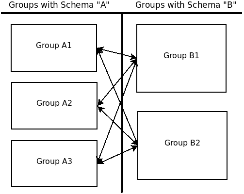

# Theory Design Document

[[_TOC_]]
  
## Introduction   
  
  This document describes at a high level the various MPC protocols we use, and how they are used together to compute the results of a query. At a very high level, every operation will consist of some private set operation (PSO) followed by some additional MPC.
    
## Crypto assumptions

- Core MPC implemented by $`m`$ data-owner parties, with a different party playing the role of dealer (see [arch doc](arch#safrn1-parties-involved))
- At most two verticals (per query, as of SAFRN 1.0), with $`m_1`$ parties from the first vertical and $`m_2`$ parties from the second vertical. We may implement more than two verticals in SAFRN 1.1.
- Honest-but curious adversaries
- Corruption threshold: Up to $`m-1`$ data owners *OR* the randomness dealer can be corrupted (any data owners + the dealer currently compromises security). The analyst and data owners can be corrupted without compromising security, since they see nothing other than what they're supposed to see.
- Acceptable leakages:
  - Can leak an upper bound on the size of sets $`\{A_i,B_j\}`$
  - Cannot leak the size of intersections $`A_i \cap B_j`$

## Private Set Operations
  
We write PSO to refer to a private set operation. This could be private set intersection (PSI), private set union (PSU), or any other operation on sets, e.g. the operation corresponding to a SQL LEFT JOIN.

The functionality of PSO is to produce a single unified table from all data owners in two separate verticals. Certain columns of each vertical are designated as `key` columns and others as `payload` columns. We assume that the concatenation of keys is unique across all horizontal parties of each vertical, and create the combined table by merging rows from each vertical with matching keys.

This operation will generally be combined with some other lightweight MPC on payloads that can be integrated with the PSO protocol. We write PSO+X for this integrated protocol, e.g. PSO+SUM for a sum over payloads belonging to the intersection or union.

To implement this functionality, a single merged table may or may not need to be constructed, depending on the query and the number of parties.

PSO is made up, broadly, of two steps: A secure sorting step that sorts by keys, followed by a compare step to identify adjacent elements with matching keys. When the secure sort begins with a secure shuffle protocol, this is the "Shuffle+Sort+Compare" paradigm.

### Sorting protocols

In SAFRN 1.0, we encounter four versions of secure sorting, based on the number of data owners participating and whether the input is private or shared. The four versions are:  
  
  1. 2PC PISO PSO
  2. 2PC SISO PSO
  3. MPC PISO PSO
  3. MPC SISO PSO  
  
  Because PISO PSO can be perform naturally by sharing all inputs and then running SISO PSO, and because 2PC is a special case of MPC, it is sufficient to implement MPC SISO PSO. However, some optimizations exist for PISO and 2PC PSO.
  
  These protocols are described [here](/doc/wiki/crypto/pso.md).

### Compare via Map-Reduce

After sorting, elements with matching keys from different verticals will be adjacent, and we desire to extract the corresponding payloads. We can do this by filtering the list, producing a new list where the unincluded rows are replaced with dummy elements. We can also extract only the secret shared sum of the included payload elements, or we can do both, return a new list and the shared sum.

When there are duplicate records with the same key in a vertical, our algorithm selects some arbitrary record to use for the MPC calculation.

When running multiple calculations on the same data set (either to compute multiple statistics, or to compute e.g. variance, which requires $`E[X^2]`$ and $`E[X]`$), we can optimize by performing multiple distinct MPC operations on the same payload, or by replacing the payload with a tuple of payloads. There's a trade-off here between runtime efficiency and engineering work.

The comparison protocol works via the map-reduce paradigm to parallelize, giving $`O(1)`$ round complexity. The `map` step considers every pair of adjacent elements, selecting those with matching keys. The `reduce` step sums the results, requiring no communication. These protocols are described in more detail [here](/doc/wiki/crypto/mapreduce.md#PSO-compare-step)

It is also possible to implement the compare step via a linear scan. This gives some (constant factor) improvement in communication cost, but increases the round complexity form $`O(1)`$ to $`O(n)`$. We do not implement this variation because of the cost in round complexity.

### SQL Join Semantics

In SAFRN 2.0, we plan to support the four standard SQL JOIN operations: INNER, OUTER, LEFT, and RIGHT. However, we do not support arbitrary functions on columns from separate verticals the merged table. We allow only two cases:

- We compute some function on payload columns from only vertical, and sum the result over all rows satisfying the JOIN condition.
- We compute the dot product of a payload column from the left vertical and a payload column from the right vertical. The calculation ignores all rows with a NULL entry in a relevant column, so that only rows from an INNER JOIN are included. (NOTE: Implementing arbitrary polynomials across verticals is equivalent to additional pre-processing by data-owners, and could also be supported)

These restrictions mean that, on the implementation level, each query behaves like an INNER JOIN or could be executed without a JOIN statement at all. (see table below)

|  | Left vertical | Right vertical | Both verticals ($`\bot`$ when one vertical is missing) |
| ------ |  ------ | ------ | ------ |
| Inner | Inner | Inner | Inner |
| Outer | No PSO needed | No PSO needed | Inner |
| Left  | No PSO needed | Inner | Inner | 
| Right | Inner | No PSO needed | Inner |    
    
Other cases with more complex functions or different NULL behavior will not be implemented in SAFRN 1.0 but may be implemented in the future.  
  
For SAFRN 1.0, we support inner join on two verticals, the top row only.

### Handling multiple parties 

All SAFRN queries are designed to be executed by arbitrary numbers of dataowners, but some queries rely on 2PC PSO executed pair-wise as a subroutine. Other queries use full MPC PSO.

#### Pair-wise PSO

By the distributive property we have $`(A_1 \cup A_2 \dots \cup A_\ell) \cap (B_1 \cup \dots \cup B_m) = \cup_{i,j} (A_i \cap B_j)`$. The same statement is true replacing $`\cap`$ with any of the four SQL JOINs.

When computing any PSO+X where X is some function that can be evaluated by taking the sum of X over each separate subtable $`A_i \cap B_j`$, we can compute X on $`A_i \cap B_j`$ via 2PC PSO+X. Each party then computes their share of the final result by summing the shares of the result of each calculation they participated in. 

**Note, that correctness in this case depends on records in horizontally partitioned datasets being disjoint**.
Here is an illustration:

In this case, the servers labeled $`A_i`$ have the same schema, with disjoint datasets.
The same is true of the $`B_j`$ servers.
  
Note that we have to avoid leaking the size of each $`A_i`$, $`B_j`$ and $`A_i \cap B_j`$. We do this by padding $`A_i`$ and $`B_j`$ with dummy elements so they all have length equal to some publicly agreed upon upper bound $`n`$. The PSO+X operation does not reveal anything about the number of elements in the joined subtable. 

#### By true multi-party PSO

When computing PSO+X for some more complicated function (e.g. [median](/doc/wiki/zz-algorithms/Ranking.md)), there is no natural way to derive the result from computations on subsets $`A_i \cap B_j`$. Instead we run a MPC PSO operation with all $`m + \ell`$ parties to produce a sorted list of length $`(m+\ell)n`$, shared across all parties.

## Modulus conversion and comparison

An important class of subprotocols for PSO and some other settings deal with modulus conversion, bit decomposition, and comparison testing.
  
Because the result of some intermediate protocols are We require protocols for converting from XOR shares of a bit to shares of `0` or `1` `mod p`, and likewise to convert from shares of `0` or `1` `mod p` to XOR shares.
  
  We also need a `mod-p to mod-q` conversion algorithm, for `$p \ll q$`, in order to increase the modulus to allow for more precision of intermediate values in our calculation.
  
The full details of the protocols are given [here](/doc/wiki/crypto/bitconv.md) and [here](/doc/wiki/crypto/compare.md).

## Assuring Disjoint Horizontal Partitions (1.1)

### SAFRN 1.1 assurances

In SAFRN 1.1, we offer the following guarantee:

  - If one party holds multiple elements with the same key, we will use an arbitrary element with that key and ignore the others.
  - While computing median, if multiple horizontal parties hold multiple elements with the same key, we will use an arbitrary element with that key and ignore the others.
  
The details of the compare step of the secure sort described above enforce this guarantee.
  
We otherwise offer no guarantees of disjointness across horizontal partitions.

### Future possibilities

If we decide to implement horizontal set disjointedness testing, we can simply perform pairwise PSO amongst each group of horizontally partitioned datasets and assert that each intersection is empty.
Unfortunately, this leaves the question of what action to take when overlapping sets are discovered.
Simply aborting the calculation immediately could reveal too much information about the underlying sets, additionally there could be sane ways to handle duplicates.

If aborting the protocol is desired, a pairwise "PSO is null" (PSO-N) protocol could be used.
However, we may want to be careful not to immediately reveal each pair's result.
Instead, it may be prudent to OR all results before revealing each group's result.

If aborting is not desirable, we may employ any of the following strategies to perform a PSO sanitize protocol (PSO-S). Note that these protocols may output shared results, making the Join PSO step a bit more difficult.

 - Designating a heirarchy for datasets to supercede each other.
 - Using a column of the dataset to select newer or otherwise prioritized records.
 - Simply dropping the intersection, leaving the union of remaining sets.

## Algorithms to implement

The algorithms we plan to implement for SAFRN 1.0 are:

- Sum
- Count
- Mean, variance, and higher-order moments
- Linear regression
- Significance tests:
  - F test
  - T test

Full descriptions and secure implementations given [here](/doc/wiki/algorithms.md) 

Below we give a table outlining the variations used for the 1 vertical case, and the options built around 2PC versus MPC PSO.

Each algorithm has a (*) marking whether the pairwise or non-pairwise implementation is preferable.

| Algorithm | 1 vertical | Pairwise | Non-pairwise |
| ------ | ------ | ------ | ------ |
| Min/Max | Local computation + lightweight MPC | PSO+MIN, then lightweight MPC (*) | PSO+MIN | 
| Moments (and F/T tests) | Local computation + lightweight MPC| PSO+SUM, then lightweight MPC (*) | PSO+SUM | 
| Order Statistics | PSO+COUNT then sort, then scan OR binary search with repeated local computation | binary search with repeated PSO+COUNT | PSO+COUNT, then sort, then scan (*)| 
| Ridge Regression  | local computation, then linear algebra MPC | PSO+DOT PRODUCT, then linear algebra MPC (*) | PSO+DOT PRODUCT, then linear algebra MPC |