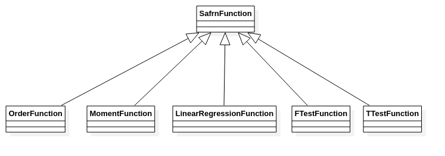

# Query

## Introduction

This documentation is intended to capture the naming, abstract type information, and rules surrounding the query.json file format.

## Structure

### Types

* ``<<integer>> Exponent_t``

  > * **Description**: Type alias to the desired datatype used for all
  > exponents in the SAFRN query code.
  
* ``<<float>> ComparisonValue_t``

  > * **Description**: Type alias used for values used in inequality statements 
  > in SAFRN query code.  Currently parsed as "float" type.
  
* ``<<integer>> VerticalIndex_t``

  > * **Description**: Type alias used for index values of vertical partitions in
  > SAFRN query code.

* ``<<integer>> ColumnIndex_t``

  > * **Description**: Type alias used for index values of columns within vertical
  > partitions in SAFRN query code.

### Data Structures

* ``ColumnExponent``

  * ``<<ColumnSpec>> col``

    > * **Description**: Column which is being exponentiated.

  * ``<<Exponent_t>> exp``

    > * **Description**: Exponent literal.

* ``FilterMultinomialTerm``

  > * **Description**: Represents any multinomial (multiplicative) term

  * ``<<ComparisonValue_t>> coefficient``

    > * **Description**: Literal constant representing the multiplication
    > factor used for the term. This value is specified as a concrete
    > floating-point type and parsed as such to ensure valid JSON formatting.

  * ``<<array<ColumnExponent>>> values``

    > * **Description**: Array of exponential values describing the 
    > multinomial term of the multiplicative operation.

    > * **Multiplicity**: ``0..*``, minimum is 0 so that constant-literal
    > multinomial term can be represented.

* ``FilterMultinomial``

  > * **Description**: Class which holds the ADDITIVE terms of the
  > multinomial (and so each slot will be added together).
  > Example: 3x^2 + 2xy is represented as the following:
  > the `terms` vector would have size two, with each term
  > (3x^2 and 2xy) being stored in the corresponding entry of `terms`.

  * ``<<array<FilterMultinomialTerm>>> terms``

    > * **Description**: All of the terms in the multinomial

    > * **Multiplicity**: ``1..*``, minimum is 1 because FilterTerm
    > doesn't know how to evaluate the comparison operation with
    > an empty FilterMultinomial.  Comparison is a binary operator
    > that requires both sides to exist of the inequality.

* ``Comparison``

  > * **Description**: Describes a selection of various binary in-equation operations

  * ``<<Enum_t>> value``

    > * **Description**: Possible values = "<", "<=", ">", ">=", "=", "!="

* ``FilterTerm``

  > * **Description**: Captures parameters needed to describe the comparison of
  > the integral result of a multinomial to a literal.

  * ``<<FilterMultinomial>> left``

    > * **Description**: Specifies the multinomial to compute during the comparison

  * ``<<ComparisonValue_t>> right``

    > * **Description**: Specifies the constant literal value compared to multinomial.
    > This value is specified as a concrete floating-point type
    > and parsed as such to ensure valid JSON formatting.

  * ``<<Comparison>> comp``

    > * **Description**: Specifies the binary comparison operator performed with:
    >   "left" as left-hand-side value
    >   "right" as right-hand-side value

* ``FilterExpression``

  > * **Description**: Describes a set of terms which will be logically AND'ed together.

  * ``<<array<FilterTerm>>> terms``
  
    > * **Multiplicity**: ``1..*``, minimum size is 1 because
    > if a FilterExpression exist, is shall not be empty.

* ``QueryFilter``

  > * **Description**: Captures top-level query filter parameters
  > and expressions which are logically OR'd together.

  * ``<<array<FilterExpression>>> expressions``

    > * **Multiplicity**: ``1..*``, minimum size is 1 because
    > if a QueryFilter exists, it shall not be empty.

* ``Polynomial<T>``

  * ``<<array<T>>> coefficients``

    > * **Description**: Stores polynomial coefficients as type ``T``. 
    > The coefficients start with lowest-order term (x^0) first.
    > Any terms skipped where the coefficient == 0, such as $1 + x^2$,
    > would have coefficients [1,0,1].  The last term in the array $\neq$ 0.

    > * **Multiplicity**: ``1..*``, minimum is 1 because an empty
    > polynomial doesn't make sense in this context.

* ``ColumnSpec``
  
  * ``<<integer>> vertical``
    
    > * **Description**: Target vertical index that column exists in.
    
  * ``<<integer>> column``
    
    > * **Description**: Target column within vertical partition.

 - ``JoinOn``
   - ``<<ColumnSpec>> col``

     > * **Description**: Target column formula is applied to.

   - ``<<Polynomial<ColumnValue>>> formula``

     > * **Description**: Target formula applied to specified column.

 - ``JoinStatement``

   - ``<<JoinType>> type``

     > * **Description**: type = {"INNER", "FULL_OUTER", "LEFT", "RIGHT"}

   - ``<<array<pair<JoinOn, JoinOn>>>> joinOns``

     > * **Description**: Describes a list of targets of the join operation.

     > * **Multiplicity**: ``1..*``, minimum 1 as a join cannot be computed
     > on an empty list of targets.  Maximum is unbounded.
   
 - ``SafrnFunction``

   > * **Description**:  A SafrnFunction object is created with the correct type based on the "type" string.
   > All of the fields required for each type are specified in "fields" node described below.

   > * **Types**:
   >   * OrderFunction
   >   * MomentFunction
   >   * LinearRegressionFunction
   >   * FTestFunction
   >   * TTestFunction

   - ``<<string>> type``

     | Field Name | Type | Description | Supported Values of "type" | Multiplicity |
     | ---------- | ---- | ----------- | -------------------------- | -------------------------- |
     | col        | ``<<ColumnSpec>``         | Target column for the function                               | OrderFunction   MomentFunction                            | ``1``                       |
     | is_percentile | ``<<bool>>``              | Type of Order statistic (percentile or k^th).                | OrderFunction                                                | ``1``                                           |
     | ascending | ``<<bool>>``              | Determines the sort-order (min -> max or vice-versa)         | OrderFunction                                                | ``1``                                           |
     | value         | ``<<size_t>>``            | Specifies 'k' (or the percentile).                           | OrderFunction                                                | ``1``                                           |
     | momentType    | ``<<MomentType>>``        | Valid values:   * "COUNT"   * "SUM"   * "MEAN"   * "VARIANCE"   * "SKEW"  * "KURTOSIS" | MomentFunction                                               | ``1``                                          |
     | dep_var       | ``<<ColumnSpec>>``        | Dependent variable of function                               | LinearRegressionFunction  FTestFunction  TTestFunction | ``1`` |
     | indep_vars    | ``<<array<ColumnSpec>>>`` | Independent variables of function                            | LinearRegressionFunction  FTestFunction  TTestFunction | ``1..*`` |
   
 - ``Query``
   
   - ``<<array<QueryFilter>>> prefilters``

     > * **Description**: Each item in the pre-filters array will correspond to a single
     > column vertical partition and no more.  Additionally, multiple
     > array elements **SHALL NOT** contain references to the same vertical.

     > * **Multiplicity**: ``0..2``, minimum is 0 in case no pre-processing is needed.
     > Maximum is 2 as only verticals supported are "IRS"/"Income" and "Schools"/"Degree".

   - ``(optional) <<JoinStatement>> joinStatement``

     > * **Description**: The query join statement captures which columns are used from disparate
     > vertical partitions to create a unified database view.  This operation occurs
     > after the prefilters have been applied/calculated.

   - ``<<SafrnFunction>> function``

     > * **Description**: Function describes the mathematical operation that
     > will be performed on the result of the joinStatements.

## Inheritance

## Functions

<!-- TODO: Paul needs to write a description of function constraints, properties, and behavior. -->

## Example

See ``query.json`` included in repository.
