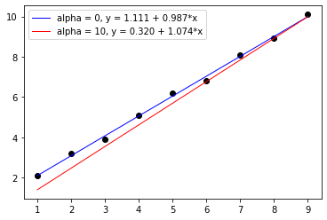

# Clear Text Examples

This document is meant to illustrate to an analyst how some of the
statistical computations that can be achieved in SAFRN by doing those
same computations in a setting without privacy or security concerns
using tools (Python, SQL) that are familiar to potentials SAFRN users.

## Version pinning
Here are the versions of Python and SQL used in these examples.

### Python

```sh
$ python --version
Python 3.6.9

$ pip install scikit-learn pandas
$ pip list

Package         Version
--------------- ------------
cycler          0.10.0
joblib          0.14.1
kiwisolver      1.2.0
matplotlib      3.2.1
numpy           1.18.3
pandas          1.0.3
pip             20.1
pyparsing       2.4.7
python-dateutil 2.8.1
pytz            2020.1
scikit-learn    0.22.2.post1
scipy           1.4.1
setuptools      46.1.3
six             1.14.0
wheel           0.34.2
```

### Postgres
```sql
SELECT version();

                                                     version
------------------------------------------------------------------------------------------------------------------
 PostgreSQL 12.2 (Debian 12.2-2.pgdg100+1) on x86_64-pc-linux-gnu, compiled by gcc (Debian 8.3.0-6) 8.3.0, 64-bit
(1 row)

```

| version                                                                                                          |
|------------------------------------------------------------------------------------------------------------------|
| PostgreSQL 12.2 (Debian 12.2-2.pgdg100+1) on x86_64-pc-linux-gnu, compiled by gcc (Debian 8.3.0-6) 8.3.0, 64-bit |
|                                                                                                                  |


# First Example (Aggregate Computations)

In this example we have two csvs, one consisting of student graduation
data at a university, and one of income data for 'all people',
including people who may not have been a student at the university.
The two csvs have a common index column `CaseID`, which allows us to
link the two tables together. Note that not all indices in one table
are present in the other table (id 4 is missing from the income table
and ids 11-13 are missing from the school table), and some indices are
present but with the corresponding values missing (id 10 is missing
both a degree and an income).

1. Graduation Data

| CaseID | Degree    |
|--------|-----------|
| 1      | Bachelor  |
| 2      | Bachelor  |
| 3      |           |
| 4      | Associate |
| 5      | Graduate  |
| 6      | Bachelor  |
| 7      | Associate |
| 8      | Graduate  |
| 9      | Graduate  |
| 10     |           |

2. Income Data

| CaseID | Income |
|--------|--------|
| 1      | 11     |
| 2      | 12     |
| 3      | 13     |
| 5      | 15     |
| 6      | 16     |
| 7      | 17     |
| 8      | 18     |
| 9      | 19     |
| 10     |        |
| 11     | 21     |
| 12     | 22     |
| 13     | 23     |

For these data sets, we are interested in answering the following questions:

1. What is the average income of all students?
2. What is the average income of students with a Bachelors degree?
3. What is the median income of students with a Graduate degree?

This data in this example is small enough that it is tractable to
compute all of these by hand.

1. $`average = \frac{11+12+13+15+16+17+18+19}{8} = 15.125`$
2. $`average_{bachelor} = \frac{11 + 12 + 16}{3} = 13`$
3. $`median = median(15, 18, 19) = 18`$

Note that for question 1 we only included ids 1-3 and 5-9, since 11-13
do not appear in the graduation table, id 4 does not appear in the
income table, and id 10 has no data in the income table.

If the data sets were too large to easily perform these computations,
what tools might we use to solve them? We'll focus on two tools
popular among data scientists: The Pandas/Numpy/Scipy/Sklearn
numerical stack in Python, and SQL (Postgres in this case).

## Python solution

```python
import numpy as np
import pandas as pd

school_df = pd.DataFrame(
  data={'CaseID': np.arange(1,11),
        'Degree': ['Bachelor', 'Bachelor', None, 'Associate',
                   'Graduate', 'Bachelor', 'Associate', 'Graduate',
                   'Graduate', None]}).set_index('CaseID')
income_df = pd.DataFrame(
  data={'CaseID': np.array([1, 2, 3, 5, 6, 7, 8, 9, 10, 11, 12, 13]),
        'Income': np.array([11, 12, 13, 15, 16, 17, 18, 19,
                            None, 21, 22, 23])}).set_index('CaseID')
df = income_df.merge(school_df, left_index=True, right_index=True)

print('Average income of all students: {0}'.format(
  df['Income'].mean()))

print('Average income of people with Bachelor degrees: {0}'.format(
  df.loc[df['Degree'] == 'Bachelor', 'Income'].mean()))

print('Median income of people with Graduate degrees: {0}'.format(
  df.loc[df['Degree'] == 'Graduate', 'Income'].median()))
```

```sh
Average income of all students: 15.125
Average income of people with Bachelor degrees: 13.0
Median income of people with Graduate degrees: 18.0
```

## sql solution

These example sql commands are executed on Postgres version `12.2`


```sql
DROP SCHEMA IF EXISTS safrn CASCADE;
CREATE SCHEMA IF NOT EXISTS safrn;

CREATE TABLE IF NOT EXISTS safrn.school (
  case_id integer PRIMARY KEY,
  degree VARCHAR(12)
);

CREATE TABLE IF NOT EXISTS safrn.income (
  case_id integer PRIMARY KEY,
  income integer
);

INSERT INTO safrn.school (case_id, degree)
VALUES (1,'Bachelor'),
       (2,'Bachelor'),
       (3, NULL),
       (4,'Associate'),
       (5,'Graduate'),
       (6,'Bachelor'),
       (7,'Associate'),
       (8,'Graduate'),
       (9,'Graduate'),
       (10,NULL);

INSERT INTO safrn.income (case_id, income)
VALUES (1, 11),
       (2, 12),
       (3, 13),
       (5, 15),
       (6, 16),
       (7, 17),
       (8, 18),
       (9, 19),
       (10, NULL),
       (11, 21),
       (12, 22),
       (13, 23);

SELECT avg(B.income) as mean_income
  FROM safrn.school A
         INNER JOIN safrn.income B
             ON A.case_id = B.case_id
 WHERE A.degree = 'Bachelor';

SELECT percentile_cont(0.5) WITHIN GROUP (ORDER BY B.income) as median_income
  FROM safrn.school A
         INNER JOIN safrn.income B
             ON A.case_id = B.case_id
 WHERE A.degree = 'Graduate';

```
If we run these commands we get the expected outcome for these queries:

| mean\_income |
|-------------|
| 15.12500000 |
|             |

| mean\_bachelor\_income |
|----------------------|
| 13.000000000         |
|                      |

| median\_income |
|----------------|
| 18             |

# Second Example (Linear Regression)

In this example we have a finite collection of numerical values $`x_i,
y_i`$ of observations and we assume that the second value $`y`$ can be
modeled as an affine linear combination of the first value $`x`$. We
will compute a line of best of fit using both Ordinary Least Squares
(OLS) and Ridge Regression. In the later example there is a
regularization parameter $`\alpha`$ that can be used to regulate some
of the problems (col-linearity, over-fitting) that can arise in
OLS. Setting $`\alpha = 0`$ reduces the calculation to OLS.


Here is a sample script of how we would derive a linear model in
Python using
[linear_model.Ridge](https://scikit-learn.org/stable/modules/generated/sklearn.linear_model.Ridge.html)
(linear regression is not easily computed in SQL so we'll skip that
solution).  We have chosen the solver `cholesky` as the solution
method (find a closed-form solution directly as opposed to an
iterative method) mirrors the solution we will use in SAFRN.

```python
import matplotlib.pyplot as plt
import numpy as np

from sklearn.linear_model import Ridge

x = np.arange(1,10)
y = np.array([2.1, 3.2, 3.9, 5.1, 6.2, 6.8, 8.1, 8.9, 10.1])

A = x[:, np.newaxis]**[0, 1]

reg_ols = Ridge(alpha=0, fit_intercept=False, solver='cholesky').fit(A, y)
y_predict_ols = reg_ols.predict(A)

ridge_alpha=10
reg_ridge = Ridge(ridge_alpha, fit_intercept=False, solver='cholesky').fit(A, y)
y_predict_ridge = reg_ridge.predict(A)

_, ax = plt.subplots()

ax.scatter(x, y,  color='black')
ax.plot(x, y_predict_ols, color='blue',
        label='alpha = {0}, y = {1:04.3f} + {2:04.3f}*x'
        .format(0, *reg_ols.coef_), linewidth=1)
ax.plot(x, y_predict_ridge, color='red',
        label='alpha = {0}, y = {1:04.3f} + {2:04.3f}*x'
        .format(ridge_alpha, *reg_ridge.coef_), linewidth=1)
ax.legend()
```
If we run this script we get two lines representing our two potential
lines of best fit.


